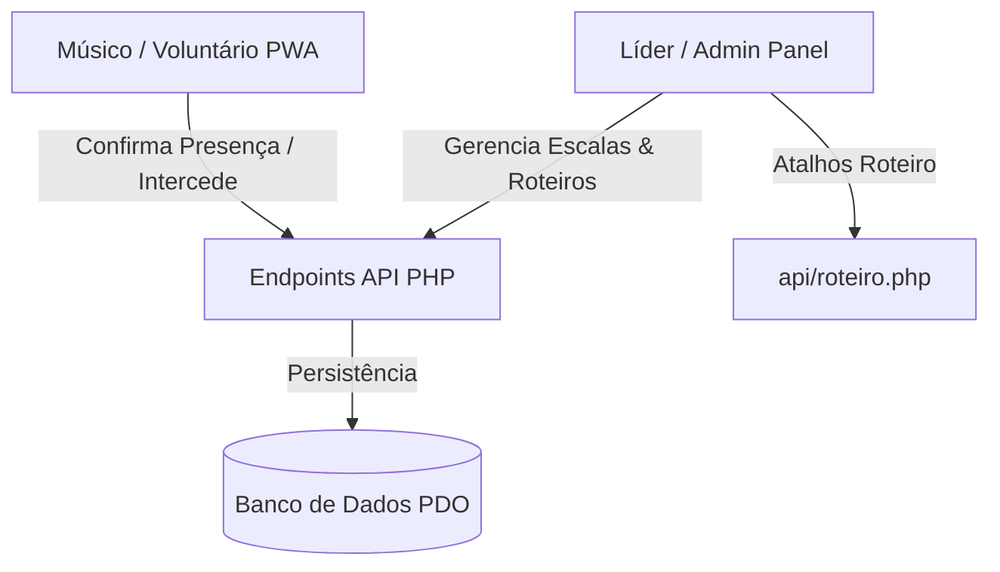

# Mapeamento do Ecossistema PWA Louvor — PIB Oliveira

Este documento fornece um inventário técnico completo de todas as funcionalidades, fluxos, botões e integrações implementados até o momento no **App Louvor PIB Oliveira**, divididos entre as áreas voltadas para os voluntários (PWA mobile-first) e o painel administrativo de liderança.

---

## 1. Visão Geral da Arquitetura

O sistema é construído sobre uma arquitetura purista (PHP 8 + Vanilla JavaScript/CSS) com suporte completo a banco de dados relacional (PDO/MySQL). O estilo visual segue um Design System premium moderno com glassmorphism, responsividade otimizada para 375px (iPhone/Android) e conformidade estrita ao *Dark Mode* e às restrições de banimento de tons roxos (*Purple Ban*).

---

## 2. Inventário de Telas e Funcionalidades

### A. Dashboard do Voluntário (`app/index.php`)
A página inicial que recebe o músico do ministério. Projetada em formato de Bento Cards, apresenta as informações de forma limpa e tátil.

* **Saudação Dinâmica:** Detecta o período do dia (Bom dia, Boa tarde, Boa noite) e exibe o primeiro nome do músico com seu respectivo avatar.
* **Versículo do Dia:** Bloco com mensagem edificante rotativa com base no dia da semana.
* **Card Bento de Próxima Escala:**
  * Exibe data, tipo de evento (Culto de Domingo, Jovem, etc.) e o instrumento/função do voluntário na respectiva data.
  * **Botão "Confirmar com Alegria" [🙏]**: Envia requisição Fetch imediata para `api/confirm_scale.php`. Atualiza o estado visual instantaneamente com efeito suave (Optimistic Update) e exibe badge de "Confirmada".
  * **Botão "Justificar Ausência" [⚠️]**: Abre um modal flutuante com fundo borrado (glassmorphism) contendo uma caixa de texto explicativa. Ao clicar em **"Enviar Justificativa"**, realiza requisição Fetch e atualiza o estado da escala com badge de "Recusada".
* **Card Bento "Orando em Unidade" (Pedidos de Oração):**
  * Lista os dois pedidos de oração ativos ou urgentes com foto do autor (ou indicação de anônimo).
  * **Botão "Interceder" [🙏]**: Permite ao músico demonstrar intercessão em tempo real. Implementa *Optimistic Update* que incrementa a contagem de intercessores instantaneamente, com mecanismo de rollback automático em caso de erro na API `api/toggle_intercession.php`.
* **Pop-up Litúrgico de Leitura Bíblica:**
  * Detecta se o progresso de leitura bíblica do dia corrente do mês ainda não foi registrado e apresenta pop-up convidativo redirecionando para `app/leitura.php`.
* **Acesso Rápido (Atalhos):**
  * Botão **Minhas Escalas** (`admin/escalas.php`)
  * Botão **Repertório** (`admin/repertorio.php`)
  * Botão **Histórico** (`admin/historico.php`)
  * Botão **Ausências** (`admin/indisponibilidade.php`)

---

### B. Plano de Estudo e Leitura Bíblica (`app/leitura.php`)
Área dedicada à edificação teológica integrada à rotina dos músicos:
* Exibe a meta diária de leitura bíblica com suporte a controle dinâmico por mês e dia.
* **Botão "Marcar como Lido"**: Registra o avanço diário do usuário via Fetch para `api/reading_progress.php`, atualizando barras de progresso visuais.

---

### C. Painel do Líder: Detalhes da Escala (`admin/escala_detalhe.php`)
A tela central para edição e gerenciamento da escala da semana.

* **Bloco da Equipe:** Exibe todos os voluntários divididos por categorias e ministérios (Vozes, Harmonia, Ritmo, Som & Apoio), com badges de status de presença (Confirmada, Pendente, Justificada).
* **Gestão de Repertório (Setlist):** Permite anexar canções à escala, visualizar tons sugeridos e customizar tons individuais.
* **Sistema de Ordem de Culto (Roteiro Litúrgico):**
  * Permite adicionar blocos de liturgia (Leitura, Oração, Palavra, Canções, Ceia) interligados ao setlist.
  * **Dropdown "Modelos de Roteiro" [⚡]**:
    * Apresenta atalhos de injeção rápida baseados em liturgias batistas: **Celebração**, **Tradicional** e **Ceia**.
    * **Ação ao clicar no Modelo:** A função Javascript `applyLiturgyTemplate(templateType)` executa múltiplas requisições assíncronas em paralelo usando `Promise.all` para `../api/roteiro.php`. Popula a escala com todos os itens do modelo no banco de dados e reconstrói visualmente a lista de liturgia instantaneamente.
* **Engagement & Comentários:**
  * Caixa de chat para interação interna da equipe, permitindo avisos rápidos de última hora sobre ensaios.

---

### D. Detalhes de Música & Referências (`admin/musica_detalhe.php`)
Ficha técnica completa de cada canção do repertório.

* **Cards de Referências Digitais:** Links dedicados para YouTube, Spotify, Cifra Club e Deezer.
  * Links abrem de forma isolada (`target="_blank" rel="noopener"`).
  * Design otimizado para o Dark Mode: Os ícones dos tocadores de áudio mudam de fundo dinamicamente para evitar clarões brancos. O Deezer utiliza o tom Slate (`#64748b`) para alto contraste em fundo escuro, mantendo-se estritamente alinhado ao banimento de roxos.
* **Visualizador de Cifra e Letras:** Transposição de tons integrada e rolagem automática para visualização fluida em ensaios.

---

### E. Endpoints de Integração (API JSON)

* `api/confirm_scale.php`: Recebe confirmações ou rejeições (ausências) e persiste no banco na tabela `schedule_users`.
* `api/toggle_intercession.php`: Registra intercessões de oração, incrementando estatísticas.
* `api/roteiro.php`: Processa inserção e remoção de elementos da ordem do culto litúrgico.
* `api/reading_progress.php`: Mantém o progresso de leitura bíblica de cada membro.

---

## 3. Próximos Passos de Refinamento Litúrgico e Técnico

Com as funções base perfeitamente mapeadas e implementadas, os próximos passos concentram-se em expandir a usabilidade e o dinamismo de acordo com o plano litúrgico batista:

- **Fase 1: Notificações Push Ativas para Escalas e Orações:**
  * Ativar o Service Worker (`sw.js`) com push reminders para escalas não confirmadas 48h antes do culto.
- **Fase 2: Enriquecimento Teológico e Estudo Bíblico Avançado:**
  * Enriquecer a página `app/leitura.php` com comentários teológicos semanais e prompts de reflexão guiados baseados na ordem de leitura.
- **Fase 3: Transmissão de Roteiro em Tempo Real (Modo Culto):**
  * Criar um visualizador simplificado da "Ordem do Culto" na área do voluntário que atualiza em tempo real conforme o líder avança os itens no painel administrativo.
