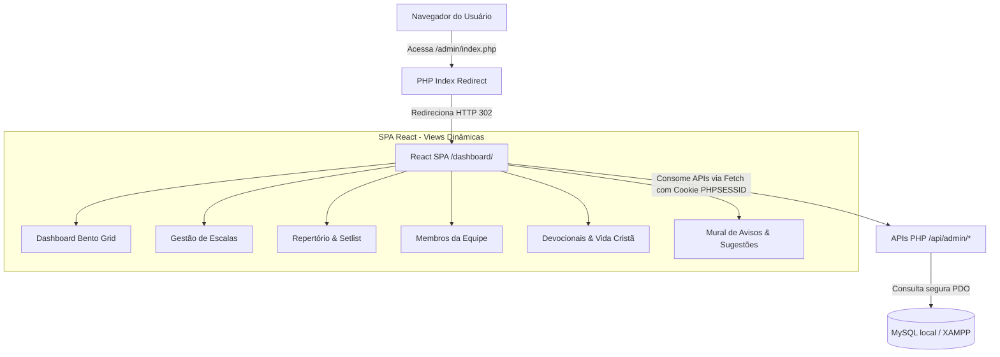

# PLAN-react-full-migration - Migração Completa para React SPA

Plano de ação robusto e estruturado utilizando a metodologia GSD para descontinuar o painel administrativo PHP multi-page legado e migrar 100% das páginas administrativas para uma Single Page Application (SPA) em **React + TypeScript + Tailwind CSS v4**, preservando e conectando todos os dados locais existentes no banco MySQL.

---

## 🏛️ Arquitetura Geral Proposta

---

## 🏃 Waves de Execução GSD

### 🌊 Wave 1: Roteamento da SPA & Redirecionamento da Entrada
* **Meta**: Tornar o React a rota principal de entrada e criar o motor de navegação interna (SPA) sem quebrar o fluxo do usuário.
* **Ações**:
  1. **Redirecionamento no PHP**: Modificar [admin/index.php](file:///c:/Users/diego/Meu%20Drive/02.%20Trabalho/04.%20Vilela.eng%20Site/APP%20Louvor%20%28COM%20STICH%29%20com%20REACT/admin/index.php) para redirecionar automaticamente para `../dashboard/` caso o líder esteja autenticado.
  2. **SPA Router**: Criar um sistema de roteamento baseado em estado ou rotas (`currentView`) no `App.tsx` do React para alternar entre as visualizações mantendo a barra de navegação ativa e fluida.
  3. **Sidebar Sincronizada**: Atualizar as ações dos botões na [Sidebar.tsx](file:///c:/Users/diego/Meu%20Drive/02.%20Trabalho/04.%20Vilela.eng%20Site/APP%20Louvor%20%28COM%20STICH%29%20com%20REACT/dashboard/src/components/layout/Sidebar.tsx) para mudar a `currentView` reativamente em vez de recarregar a página inteira.

---

### 🌊 Wave 2: Endpoints JSON Backend (PHP)
* **Meta**: Criar APIs JSON seguras e de alta performance reutilizando as queries e lógicas das páginas PHP originais.
* **Arquivos Novos**:
  1. `[NEW]` [api/admin/escalas_api.php](file:///c:/Users/diego/Meu%20Drive/02.%20Trabalho/04.%20Vilela.eng%20Site/APP%20Louvor%20%28COM%20STICH%29%20com%20REACT/api/admin/escalas_api.php): Retorna a lista de escalas (futuras e passadas), setlist de músicas de cada escala, e status de presença dos instrumentistas.
  2. `[NEW]` [api/admin/repertorio_api.php](file:///c:/Users/diego/Meu%20Drive/02.%20Trabalho/04.%20Vilela.eng%20Site/APP%20Louvor%20%28COM%20STICH%29%20com%20REACT/api/admin/repertorio_api.php): Retorna todas as músicas, tonalidades, links (Spotify/Youtube), cifras e histórico de execução.
  3. `[NEW]` [api/admin/membros_api.php](file:///c:/Users/diego/Meu%20Drive/02.%20Trabalho/04.%20Vilela.eng%20Site/APP%20Louvor%20%28COM%20STICH%29%20com%20REACT/api/admin/membros_api.php): Lista todos os membros da equipe de louvor, seus ministérios, e dados de contato.
  4. `[NEW]` [api/admin/devocionais_api.php](file:///c:/Users/diego/Meu%20Drive/02.%20Trabalho/04.%20Vilela.eng%20Site/APP%20Louvor%20%28COM%20STICH%29%20com%20REACT/api/admin/devocionais_api.php): Fornece a lista de leituras diárias e devocionais.
  5. `[NEW]` [api/admin/avisos_api.php](file:///c:/Users/diego/Meu%20Drive/02.%20Trabalho/04.%20Vilela.eng%20Site/APP%20Louvor%20%28COM%20STICH%29%20com%20REACT/api/admin/avisos_api.php): Lista de avisos e sugestões de músicas enviadas pelos membros.

---

### 🌊 Wave 3: Telas do Ministério em React (Views SPA)
* **Meta**: Substituir as listagens brutas do PHP por interfaces modernas com Bento Grid, animações fluidas e filtros avançados.
* **Componentes Novos**:
  1. `[NEW]` `EscalasView.tsx`: Visualização de todas as escalas com abas de filtro (Futuras vs. Passadas), lista de músicas expansível, e painel interativo de confirmação de presença.
  2. `[NEW]` `RepertorioView.tsx`: Tabela interativa de músicas com busca dinâmica, filtro por ritmo/estilo, drawer lateral exibindo letra/cifra e links rápidos do Youtube/Spotify.
  3. `[NEW]` `MembrosView.tsx`: Grid de contatos dos músicos com avatars do sistema, funções ativas (Vocal, Teclado, Guitarra, etc.), e status de engajamento do mês.
  4. `[NEW]` `DevocionaisView.tsx`: Mural de devocionais com leitura limpa e focada em tipografia premium para reflexões espirituais.
  5. `[NEW]` `AvisosView.tsx`: Mural dinâmico de avisos da liderança e seção interativa para aprovar/negar sugestões de músicas recebidas da equipe.

---

### 🌊 Wave 4: Ajustes Finos, UX & Segurança
* **Meta**: Garantir a excelência de design, animações táteis, controle de sessão resiliente e suporte offline PWA.
* **Ações**:
  1. **UX Premium**: Rodar `ux_audit.py` e ajustar micro-animações nas mudanças de view.
  2. **Controle de Sessão**: Garantir que se a sessão do PHP expirar enquanto o usuário navega na SPA, o interceptador redirecione suavemente e preserve o estado local.
  3. **Build Final**: Gerar o pacote estático otimizado (`npm run build`) para colocar os arquivos de produção em `/dashboard/dist/`.

---

## 📋 Critérios de Aceitação & Verificação (UAT)

| Caso de Teste | Ação | Comportamento Esperado | Status |
|---|---|---|---|
| **T01: Redirecionamento** | Acessar `http://localhost:8080/admin/index.php` | Redirecionar automaticamente para `/dashboard/` | `[ ]` |
| **T02: Navegação SPA** | Clicar em "Repertório" na Sidebar | Mudar a visualização para a lista de músicas sem recarregar a aba | `[ ]` |
| **T03: Consumo de APIs** | Entrar na aba "Escalas" | Carregar dados reais vindos do banco de dados via `escalas_api.php` | `[ ]` |
| **T04: Metrônomo Sonoro** | Acessar o Metrônomo e apertar iniciar | Emitir som de clique sintetizado via Web Audio API e pulsar visualmente | `[x]` |
| **T05: Segurança 401** | Forçar expiração de cookie e navegar | Redirecionar para `/index.php` na porta correta | `[x]` |

---

## ⚠️ Atenção e Boas Práticas (Purple Ban & Estética)
* **Design System**: Usar cantos retos (`rounded-[4px]`), sem degradês chamativos ou efeitos fluorescentes.
* **Sem Roxo/Neon**: Rigorosa obediência ao **Purple Ban** (apenas Worship Blue `#2E7EED`, Altar Gold `#FFC107`, fundo profundo `#121316` e cards `#1C1E22`).
* **Preservação de Dados**: Todas as novas APIs farão consultas `SELECT` simples usando PDO nas tabelas existentes do XAMPP (`pibo_louvor` / `louvor_pib`), sem alterar nenhum registro ou apagar tabelas atuais.
